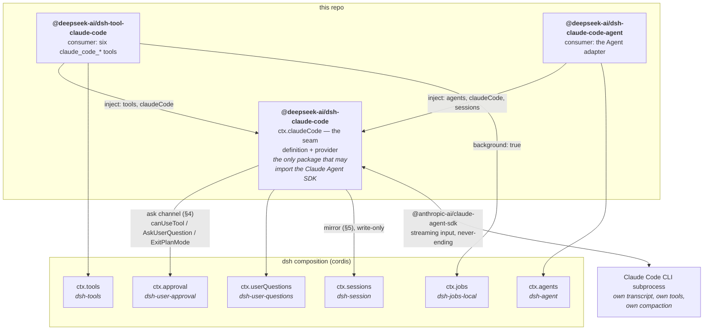

# dsh-claude-code

**Claude Code as a first-class citizen of the DeepSeek Harness.**

Three cordis plugins that let a dsh composition open, drive, watch and tear down real
[Claude Code](https://www.anthropic.com/claude-code) sessions — with Claude Code's permission
prompts, clarifying questions and plan reviews routed into dsh's own human-in-the-loop seams,
and everything the session does mirrored into a dsh session log a UI can render.

Two things it is **not**. It is not a one-shot "ask Claude to write this function" call — the
harness already ships `@deepseek-ai/dsh-subagent-claude-code` for that, and this integration
deliberately does not replace it. And it is not a wrapper that re-implements Claude Code's
agent loop: the CLI keeps its own transcript, its own compaction and its own tools. What this
repo builds is the **seam** between the two systems.

> Developed out-of-tree against the published `@deepseek-ai/dsh-*@0.1.0-rc.7` packages.
> All three packages are `private: true` and keep the `@deepseek-ai/dsh-*` name so that
> upstreaming into the harness monorepo is a move, not a rename — we do not own that npm scope.

---

## What you get

| | |
|---|---|
| **Interactive sessions** | Open a session, send follow-ups, steer, interrupt, resume, fork. The session outlives the call that opened it. |
| **Human-in-the-loop, wired to dsh** | Claude Code's `canUseTool` prompts become `ctx.approval.request()`; `AskUserQuestion` becomes `ctx.userQuestions.ask()`; `ExitPlanMode` becomes a plan review, using dsh's own plan-mode conventions. |
| **A readable transcript** | Every session is mirrored into a real dsh `Session` log — turns, steps, streaming text and reasoning chunks, tool calls and results — sharing ONE id with the Claude Code session. |
| **Model-facing delegation** | Six `claude_code_*` tools, so a dsh agent's model can delegate coding work to Claude Code and read the answer back. |
| **Background work as dsh jobs** | `claude_code_open({ background: true })` registers the session as a `ctx.jobs` job: `job_list` / `job_output` / `job_kill` all work on it. |
| **CC-backed dsh agents** | Publish a Claude Code session as a `ctx.agents` entry, so a human can talk to it in the dsh UI like any other agent. |

## Architecture

The harness's capability doctrine is **Definition / Provider / Consumer**. This integration is
one seam and two consumers — `dsh-claude-code` is both the definition and the provider, because
the Claude Agent SDK *is* the backend and no alternative provider is planned.



Two rules the diagram encodes, both load-bearing:

- **Arrows into `ctx.sessions` are one-directional.** The mirror only ever writes. Nothing in a
  Claude Code session is driven from the dsh log, because Claude Code owns its own history —
  which is why replay, seed-fork and `deriveMessages()` are all invalid for a CC-backed session.
- **Only the seam imports the SDK.** The two consumers depend on the seam's types alone, and
  `tests/composition/composition.spec.ts` asserts on the built `lib/types/**/*.d.ts` of all
  three packages that no SDK specifier appears in a type position.

### The three packages

| Package | Provides | Read |
|---|---|---|
| [`packages/claude-code`](packages/claude-code/README.md) | `ctx.claudeCode` — sessions, ask channel, mirror, config, prewarm pool | seam + provider |
| [`packages/tool-claude-code`](packages/tool-claude-code/README.md) | `claude_code_open` / `_send` / `_wait` / `_status` / `_cancel` / `_close` | consumer |
| [`packages/claude-code-agent`](packages/claude-code-agent/README.md) | `ctx.claudeCodeAgents` — CC-backed `ctx.agents` entries | consumer |

## Quickstart — the delegation demo

The acceptance artifact. A stand-in "DeepSeek agent" delegates a real coding task to Claude
Code through `claude_code_open`, and the script prints the mirrored session's whole event
timeline and the file that got created.

```sh
pnpm install
pnpm run build                            # the Loader imports lib/, so build first
node examples/delegation-demo/run.mjs     # needs a logged-in `claude` CLI
```

It boots [`examples/delegation-demo/cordis.yml`](examples/delegation-demo/cordis.yml) through
the real cordis Loader — no test doubles, no mocked SDK — registers an auto-answerer that logs
every permission it grants, runs the delegation, verifies the created file's exact content, and
exits `0`. Pass `--cwd <dir>` to pick where Claude Code works; a temp directory is used
otherwise and is deliberately left behind for inspection. See
[its README](examples/delegation-demo/README.md).

Mounting it yourself is a `cordis.yml` row per package:

```yaml
- id: claude-code
  name: '@deepseek-ai/dsh-claude-code'
  config:
    defaults: { model: claude-haiku-4-5-20251001, settingSources: [] }

- id: tool-claude-code           # model-facing delegation tools
  name: '@deepseek-ai/dsh-tool-claude-code'

- id: claude-code-agent          # CC-backed dsh agents
  name: '@deepseek-ai/dsh-claude-code-agent'
```

`@deepseek-ai/dsh-jobs-local` **and** `@deepseek-ai/dsh-tool-jobs` are required for
`background: true`; `dsh-user-approval` / `dsh-user-questions` are optional but a session
without an ask target denies every tool call, fail-closed, by design.

## Test matrix

```sh
pnpm run typecheck   # every package + every spec, NodeNext strict, skipLibCheck: false
pnpm run build       # tsc -b per package -> lib/index.js + lib/types/index.d.ts
pnpm test            # build, then all three vitest projects. OFFLINE.
pnpm run test:live   # OPT-IN: DSH_CC_LIVE=1, real subprocesses, real subscription
```

| Project | What it resolves | Network / subprocess | Contents |
|---|---|---|---|
| `unit` | TypeScript **sources** (via `tsconfig` paths) | none | every package's own specs — fake backend, recorded fixtures, golden transcripts |
| `composition` | the packages' **built `lib/`** via a real Loader boot | none | `cordis.yml` and `cordis-no-jobs.yml` acceptance tests: `exports` maps, `inject` lists, `Config` schemas, the SDK-free type surface, clean disposal |
| `examples` | `run.mjs` as a real **subprocess** | live only | the delegation demo, end to end |

The two planes never meet in one process: a second copy of a module singleton breaks cordis
service resolution, so the source-plane and built-plane suites are deliberately separate
projects.

Current totals: **502 offline tests** across 32 files (plus 30 live files collected and
skipped), and **44 live tests** across 30 files. Both were last verified from a true clean
state — `node_modules`, `lib/` and every `*.tsbuildinfo` removed, then
`pnpm install --frozen-lockfile`.

**Offline is the default and stays the default.** `pnpm test` spawns no subprocess and makes no
network call; every live spec is `describe.skipIf(!LIVE)` and is collected-and-skipped instead.
The live suite drives one-sentence prompts on `claude-haiku-4-5-20251001` in isolated temp
working directories, and every spec asserts a session-scoped `pgrep` delta so no subprocess
outlives its test.

One live-suite behaviour that is working-as-intended, not a failure:
`record-fixtures.live.spec.ts` **rewrites three mirror fixtures on every live run** — that is
the recorder doing its job, and `mirror-golden.spec.ts` is the check that the projection is
still deterministic against the new recording.

> **Building:** `*.tsbuildinfo` is gitignored, so a fresh clone builds correctly. If you delete
> `lib/` by hand, delete the sibling `tsconfig.tsbuildinfo` too (or run `pnpm run clean`, which
> is `tsc -b --clean`) — otherwise `tsc -b` believes it is up to date, emits nothing, and the
> dependent packages fail with a confusing cascade of `TS6305`.

## Upstream gaps

Everything below is blocked on the SDK or on dsh rc.7, not on work in this repo. Each row is a
deliberate, documented position — none is a to-do we skipped.

| Gap | Where it bites | Today's behaviour | What closes it |
|---|---|---|---|
| **No `ignorable` on `Session.append()`** | the mirror's `claude-code/compact` event | a custom event type must carry `ignorable: true` on its envelope or an older build refuses the whole log; `append()` builds and freezes the envelope itself | `append(type, data, { ignorable: true })` upstream. Mitigations ship: `mirror: { compaction: 'skip' }`, and `markEventIgnorable()` at the seed/restore boundary |
| **SDK exposes no `cancel_queued`** | `claude_code_cancel({ keep_queued: false })`, `agent.cancel({ keepInbox: false })` | the CLI advertises `interrupt_cancel_queued_v1`, but `interrupt()` takes no arguments in SDK 0.3.233. Emulated at our layer: re-interrupt as each surviving turn starts, capped, and mark what was stopped | an SDK call that drives the advertised capability |
| **dsh approval has no `'always'` outcome** | "always allow this command" in a UI | the outcome vocabulary is `allowed-once \| rejected \| cancelled \| unavailable`, so nothing a human clicks can write a rule. Rules come from `ask.rules` config or `CcAskRules.add()` | an `'always'` outcome. The UI path is then one `add()` call away |
| **Cards for CC's own tools are not representable** | rendering a `Bash` / `Write` / `Edit` / `Read` that Claude Code ran | `tool/call` has no view slot, and a card is DERIVED by a tool-registry **name** lookup — CC's names (`Bash`) are not registered and dsh's are lowercase (`bash`). The projections ship, pure and tested, in `packages/claude-code/src/cards.ts`; **nothing is written to the log**, because every input they need is already durable there | a `presentation-only` registration on `ToolRegistry` (presenters, no `execute`, excluded from `schemas()`), or a name-independent view path in `viewFor()` |
| **Loop-only waterfalls are inert** | any plugin hooking `agent/pre-step`, `agent/request`, `agent/request-error`, `tools/pre-execute`, `agent/turn-stopping` for a CC-backed agent | these are dispatched only by `ReactLoopAgent` / `ctx.tools`, which a CC-backed agent never goes through. Exported as `INERT_DSH_MECHANISMS` with documented substitutes | nothing here; it is an honest architectural consequence |
| **`AgentOptions` has no `setModel` / `maxTokens`** | switching a CC-backed agent's model | model changes go through the package-level `setModel()` → `query.setModel()`; `maxTokens` is never populated, because Claude Code owns its own request configuration | nothing here |
| **Always-allow rules are ours, not the SDK's** | rules written by this integration | a headless `canUseTool` never writes `.claude/settings.local.json` (verified in a spike, with `settingSources: []` **and** `['local']`) — so our rule cache and the user's interactive CLI are two stores with no sync | an SDK contract for persisting `updatedPermissions` |

Cross-cutting, and worth knowing before you build on this: **dsh's session log for a CC session
is a record, not a context.** Claude Code compacts its own transcript and the mirror does not
rewrite to match, so after a compaction the mirror is the more complete history while the CLI's
live context is a summary. Treating them as interchangeable is a category error, not a bug.

## Relationship to the harness monorepo

Developed out-of-tree in this repo — the Phase 0 spikes proved a plain
`@deepseek-ai/cordis@4.0.1` + `dsh-*@0.1.0-rc.7` install boots both ways (bare `ctx.plugin()`
and Loader + `cordis.yml`) and type-checks with `skipLibCheck: false`. That bought fast
iteration at the cost of the monorepo's free gates (doc-sync, per-file 100 % coverage,
assembled snapshot suites), which this repo substitutes with its own composition + live suites.

Monorepo conventions were followed anyway, so upstreaming is mechanical:

- named exports only, never `export default` (harness post-mortem 0001: a default export
  silently drops the plugin's `inject` list);
- `src/` → `lib/` + `lib/types/` layout, `exports` map, schemastery `Config`;
- `@deepseek-ai/cordis` is a **peer** dependency everywhere — two copies break service
  resolution;
- exact pins throughout (`@anthropic-ai/claude-agent-sdk@0.3.233`, `dsh-*@0.1.0-rc.7`).

**Upstreaming path.** Move `packages/claude-code` → `packages/claude-code/claude-code/`,
`packages/tool-claude-code` → `packages/claude-code/tool-claude-code/`, and
`packages/claude-code-agent` → `packages/claude-code/claude-code-agent/`; swap every exact
`0.1.0-rc.7` pin for `workspace:^`; drop the `private: true` flags. The remaining work is the
monorepo's own gates (per-file 100 % coverage, doc-sync, an assembled snapshot scenario for the
model-visible tool surface) — none of which requires a code change here. The existing
`@deepseek-ai/dsh-subagent-claude-code` stays where it is: it is one-shot delegation, and this
integration is the interactive complement, not a replacement.

## Documentation

| Document | What it is |
|---|---|
| [`docs/phase1-api-contract.md`](docs/phase1-api-contract.md) | **the source of truth.** The complete export surface, every phase's corrections and deviations, and the verification bar |
| [`docs/spec-review-and-plan.md`](docs/spec-review-and-plan.md) | the spec review (SDK deltas S1–S14, dsh deltas D1–D16), the phase plan, the Phase 0 spike results, and §8 project completion status |
| [`docs/dsh-claude-code-integration.md`](docs/dsh-claude-code-integration.md) | the original design spec this was built from |
| `spikes/` | Phase 0 probe scripts and their logs — an independent npm project, not part of the build |

## Licence & distribution note

MIT. Using your own claude.ai subscription through this integration is ordinary personal use.
**Third parties may not offer claude.ai login or subscription limits to their own users without
Anthropic's approval** — if you redistribute a product built on this, configure API-key auth
(`auth: 'api-key'` + `ctx.credentials`) rather than shipping subscription login.
